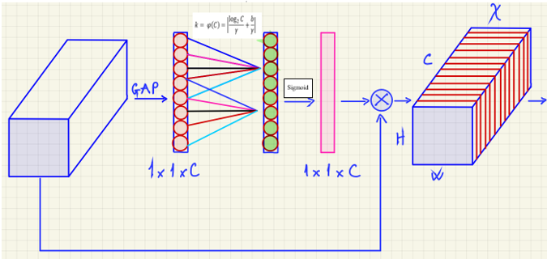

# Pedestrian Detection Using YOLO with Improved Attention Module (Master Thesis)

## Introduction

This thesis presents an improved Yolov5 's framework for pedestrian detection. We propose two new attention modules for Yolov5 architecture to highlight significant information. First, the modified Efficient Channel Attention (M-ECA) was applied in the backbone of Yolo network to collect the useful features. Second, the modified Global Attention Mechanism (M-GAM) was inserted in the head of Yolo network to enhance feature representation. We conduct comprehensive experiment to prove the enhancement of this algorithm on pedestrian detection.

## Proposed Yolov5 's Architecture

- **M-GAM Architecture**

- **M-ECA Architecture**

## PenFudan  Dataset

In our experiment, we used dataset **Penn-Fudan**, which included 170 images with 345 labeled pedestrians

The dataset is open for free use, raw data download at (https://www.cis.upenn.edu/~jshi/ped_html/) or data which already processed (https://universe.roboflow.com/deeplearningresearch/pedestrian-detection-ghbtz ). 

## Results

- **YOLO v5s owns the best mAP, 87.4%.**

 

Figure: Comparision Results.

- **Test on GPU of Jetson Orin Nano, we chose approriate torch and pytorch library **

 

Figure: Testbench Results.

## Citation
`
P.H.Long
`

